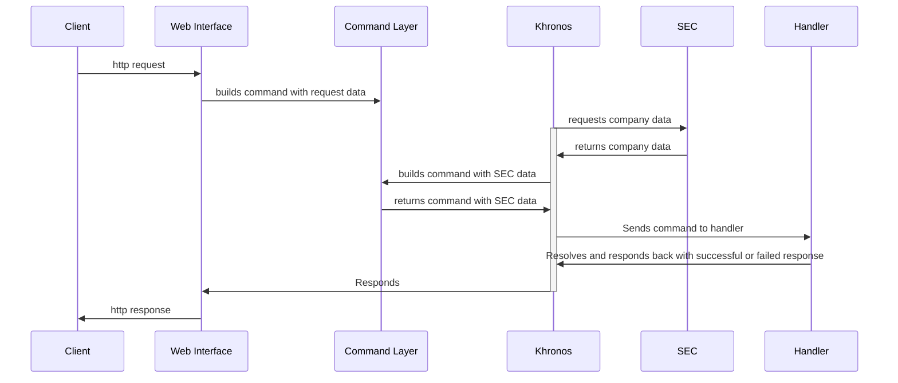

## How to run this app

### Install dependencies

You have first to install all languages dependencies. You can do as you please, but we recommend [ASDF](https://asdf-vm.com/), since it will be as simple as running in the root folder:

```
asdf install
```

However, you can find a relation of language and versions in `.tool-versions.yml` file if you prefer other methods.

### Setup docker compose

For simplicity of our setup, we recommend [Docker](https://www.docker.com/) and [Docker Compose](https://docs.docker.com/compose/). With that, you are able to just run on the root folder:

```
docker compose --profile database up
```

### Check instalation

```
mix setup
mix ci
```

### How to use it

First setup the server! Run:

```
docker compose --profile "*" up
```

You may want [to download Insomnia](https://insomnia.rest/download) and use our `insomnia-testing-library.json` file to import into your local setup all needed requests.

There you will find requests separated by two namespaces, `/api` and `/admin`. The API namespace is intended to keep the resolvers for public calls, such as for retrieving companies, or trades. The admin is intended to have requests for seeding and synching our local database with SEC's.

The whole flow can be described in the following steps:

- Import all SEC's companies database into ours: you can do this by requesting `Import Companies From SEC`;
- Once that background job is resolved (very fast), you can request for a company info using `Get Company` and passing the `ticker` as a path parameter (you can try AAPL or MSFT);
- So far so good? Let's import some company's data with `Import Company Trades From SEC`, which requires you to send the the company's `ticker`. That is going to schedule several jobs to be resolved asynchronously while guaranteeing that SEC's fair-use policy of rate-limiting is respected;
- You can start pooling the request `Get Company Insider Tradings` to see the increasing number of trades for a given company `cik` identifier.

### Architecture



### Next steps

- Implement Market Cap field in the company model pulling from actual data instead of mocking it;
- Implement authentication and authorization on Admin Controller;
- Implement loaders for the jobs' progress: that is not hard to do using Oban's jobs statuses, but the time contraints limited me from achieving it;
- Improve tests:
  - Use server mocking (Bypass, for instance) for testing SEC modules;
  - Create integration integration tests.

### Important considerations

- Oban is known to perform poorly when we have millions of scheduled jobs, so we might consider changing it to something more reliable for that case, streaming services - Kafka, for instance;
